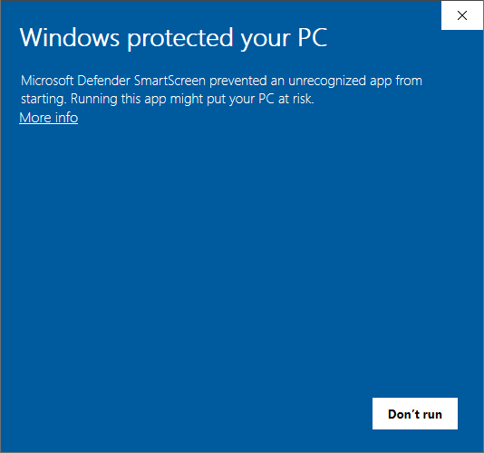
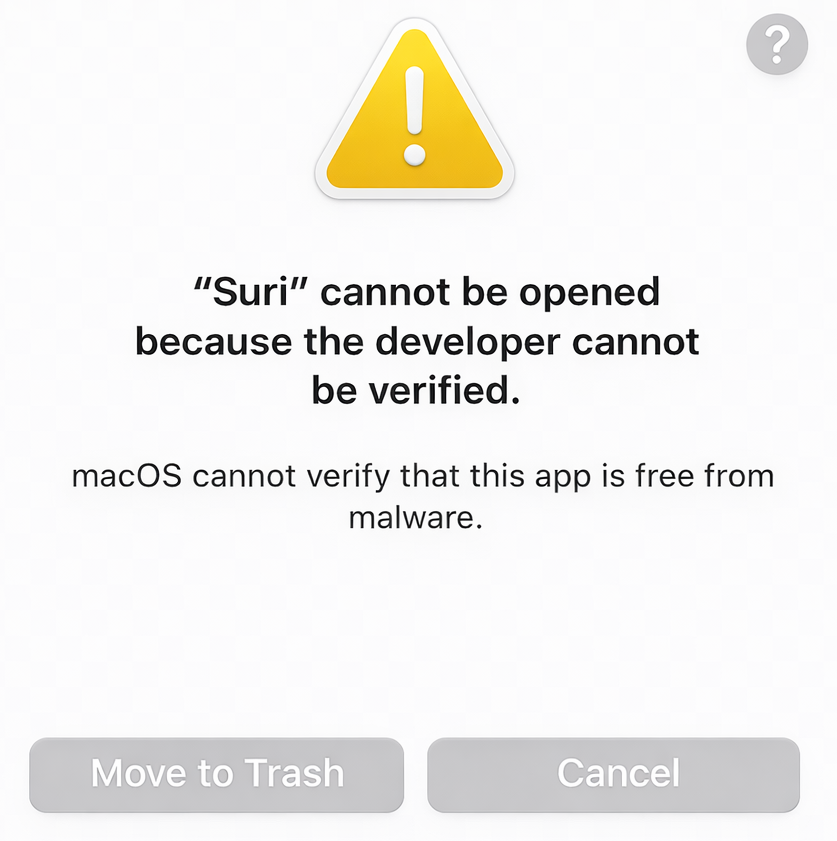

<a id="readme-top"></a>

<p align="center">
  
</p>

<p align="center">
  
  
  
  
</p>

<p align="center">
  <strong>Facenox is an offline-first face recognition system for attendance.</strong><br>
  Built for privacy. It handles detection, matching, and liveness checks entirely on your local hardware so your biometric data never leaves your device.
</p>

---

> [!CAUTION]  
> This is the official open source repository for Facenox. Treat other repositories, installers, and downloads as unverified unless they come from official sources.

> [!NOTE]  
> **Privacy First:** Facenox is built on the principle that you should own your biometric data. Detection, tracking, and matching happen entirely on your local hardware.

## Why Facenox

Most face recognition systems rely on cloud-based biometrics. Facenox doesn't. Biometric matching stays local on the desktop.

| Feature | Facenox | Cloud-Based Systems |
| :--- | :---: | :---: |
| **Data Residency** | 100% Local | Remote Cloud |
| **Internet Dependency** | Optional | Mandatory |
| **Latency** | Real-time | Network Dependent |
| **Privacy Risk** | Minimized | High |

## Features

- **Local Biometrics:** Face detection, recognition, subject tracking, and liveness checks via [face-antispoof-onnx](https://github.com/facenox/face-antispoof-onnx).
- **Consent-Aware:** Built-in support for biometric enrollment and deletion consent.
- **Subject Management:** Full control over group and member directories.
- **Attendance Tracking:** Automated session recording and CSV/JSON exports.
- **Secure Storage:** Encrypted local biometric storage and password-protected `.facenox` backups.
- **Optional Sync:** Secure pairing with Facenox Dashboard for centralized reporting without uploading raw biometric data.

## Performance

- **No GPU Required:** Real-time matching on standard CPUs.
- **Environment:** Optimized for controlled lighting and consistent setups.
- **Hardware:** Verified on hardware as old as 2nd-gen Intel i5 (2011), 4th-gen i3 (2015), and 8th-gen i5 (2018) laptops.

## Offline-First Behavior

Facenox Desktop continues to work locally when internet access is unavailable:
- Recognition and liveness verification remain functional.
- Attendance is recorded and stored in a local SQLite database.
- Settings, backups, and member management remain accessible.
- Remote Sync and Dashboard pairing resume automatically when connectivity returns.
    (You can turn them off and never sync to the dashboard in settings.)

> [!NOTE]  
> **Privacy Assurance:** Remote Sync and Dashboard pairing only push attendance snapshots and metadata. Facenox **never uploads raw face images or face embeddings** to the cloud; matching always stays on your hardware.

## How it works

### Where is the data stored?
Everything is stored in a local SQLite database on your machine. Biometric templates are encrypted at rest.

### Does it need the internet?
No. All biometric processing (face detection, recognition, liveness checks, and tracking) works 100% offline. Internet is only required if you choose to sync attendance metadata to the optional Facenox Dashboard.

### What hardware do I need?
It's designed for standard CPUs and has been tested on hardware as old as 2nd-gen Intel i5 (2011), 4th-gen i3 (2015), and 8th-gen i5 (2018) laptops. No dedicated GPU or CUDA setup is required.

## Roadmap

- [x] Support for cross-platform native installers (Windows, macOS, Linux).
- [ ] Organization-level code signing and notarization.
- [ ] Multi-device biometric profile synchronization.
- [ ] Mobile companion application for remote monitoring.
- [ ] Attendance trends and site-level reporting in Facenox Dashboard.

---

> [!IMPORTANT]  
> **Management Dashboard:** The Facenox Dashboard is an optional separate service. This repository contains the source for the **desktop application only**.

## Download

Latest prebuilt binaries are available on the [GitHub Releases](https://github.com/facenox/facenox/releases/latest) page.

If you want to build from source, please follow the [Installation Guide](docs/INSTALLATION.md).

## Installation Notes

Facenox is in active development. Until code-signing is finalized in a future release, you may encounter OS security prompts.

> [!WARNING]  
> **Windows SmartScreen:** If blocked, click **More info** then **Run anyway**.
> 
> 

> [!TIP]  
> **macOS Gatekeeper:** If blocked, **Right-click** the app, select **Open**, then confirm the prompt.
> 
> 

## Documentation

- [FEATURES.md](docs/FEATURES.md): Capabilities and out-of-scope items.
- [ARCHITECTURE.md](docs/ARCHITECTURE.md): System design and sync boundaries.
- [INSTALLATION.md](docs/INSTALLATION.md): Local development setup.
- [TROUBLESHOOTING.md](docs/TROUBLESHOOTING.md): Common setup and runtime issues.
- [CODE_SIGNING_POLICY.md](docs/CODE_SIGNING_POLICY.md): Release identity and trust rules.
- [PRIVACY.md](docs/PRIVACY.md): Data handling and consent policy.
- [SECURITY.md](SECURITY.md): Vulnerability reporting policy.
- [TESTING.md](app/TESTING.md): Frontend and Electron app testing conventions.

## Tech Stack

### Local Backend
- **Runtime:** Python 3.10+ (FastAPI)
- **Inference:** ONNX Runtime, OpenCV
- **Tracking:** ByteTrack (High-performance MOT)
- **Anti-Spoofing:** [face-antispoof-onnx](https://github.com/facenox/face-antispoof-onnx)
- **Storage:** SQLite, SQLAlchemy, Alembic

### Desktop App
- **Framework:** Electron, React 19
- **Build Tooling:** Vite, TypeScript, Tailwind CSS

## Development Quickstart

```bash
# 1. Clone the repo
git clone https://github.com/facenox/facenox.git
cd facenox

# 2. Setup Local Backend
python -m venv venv
source venv/bin/activate  # or venv\Scripts\activate
pip install -r server/requirements.txt

# 3. Setup Desktop App
pnpm install

# 4. Run Development Workspace
./dev-start.sh
```

## Contributing

Pull requests are welcome. Read [CONTRIBUTING.md](CONTRIBUTING.md) before opening a PR, especially for changes affecting privacy or biometric data.

## Acknowledgments

- [FastAPI](https://fastapi.tiangolo.com/)
- [ONNX Runtime](https://onnxruntime.ai/)
- [OpenCV](https://opencv.org/)
- [Electron](https://www.electronjs.org/)
- [React](https://react.dev/)
- [THIRD_PARTY_LICENSES.md](THIRD_PARTY_LICENSES.md)

## License

Facenox is licensed under the **GNU AGPL v3**. See [LICENSE](LICENSE) for details.