<a id="readme-top"></a>

<h1 align="center">
  
</h1>

<p align="center">
  <a href="LICENSE"></a>
  <a href="https://github.com/facenox/facenox/releases"></a>
  <a href="https://github.com/facenox/facenox/releases"></a>
  <a href="https://github.com/facenox/facenox/stargazers"></a>
</p>

<p align="center">
  <strong>Facenox is an open-source, offline-first face recognition software for real-time attendance tracking.</strong><br>
  Built for privacy: No photos are saved. Biometric templates are end-to-end encrypted (E2EE).
</p>

<p align="center">
  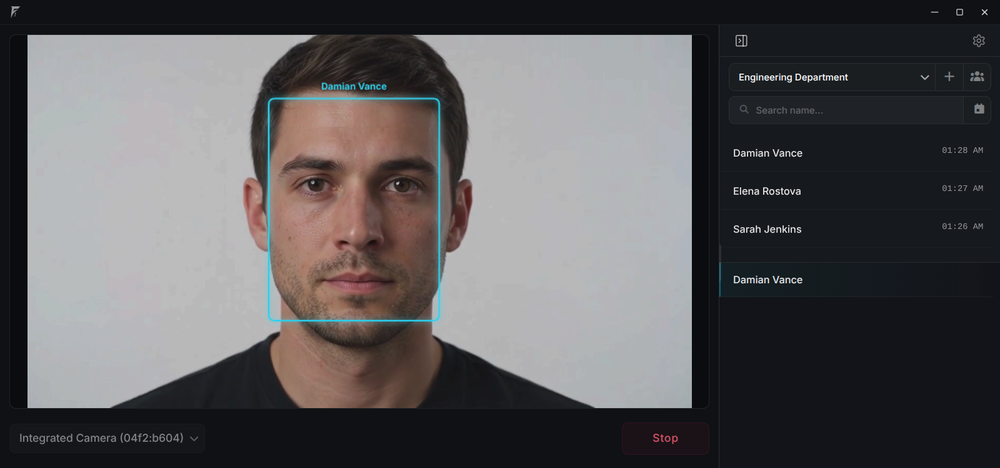
</p>

## Screenshots

<details>
<summary><strong>UI Gallery</strong></summary>

### Main Interface

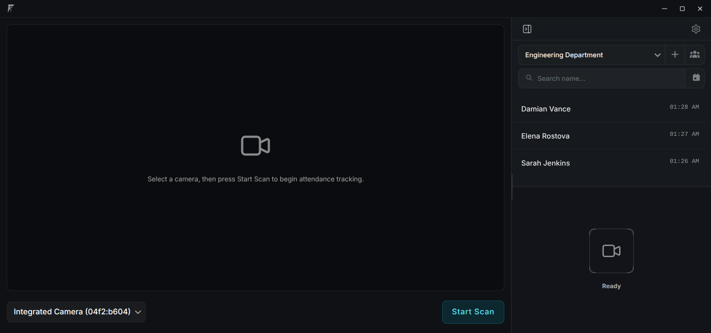
<br/>

_Primary control interface for video hardware setup and active biometric scanning, featuring real-time face detection and multi-subject tracking._

### Overview

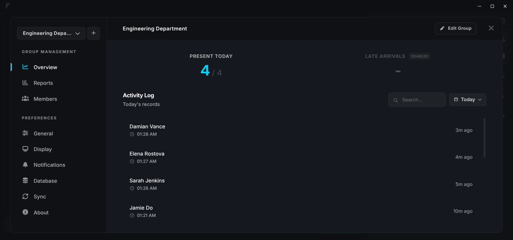
_Overview dashboard displaying real-time metrics for 'Present Today' and 'Late Arrivals' alongside a live Activity Log._

### Reports

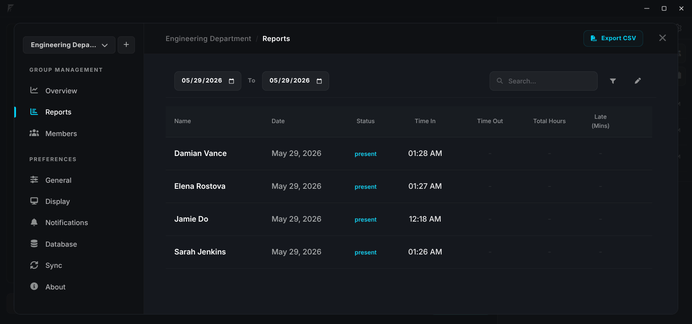
_Reports interface detailing attendance records, featuring built-in tools for manual session editing and CSV data export._

### Members

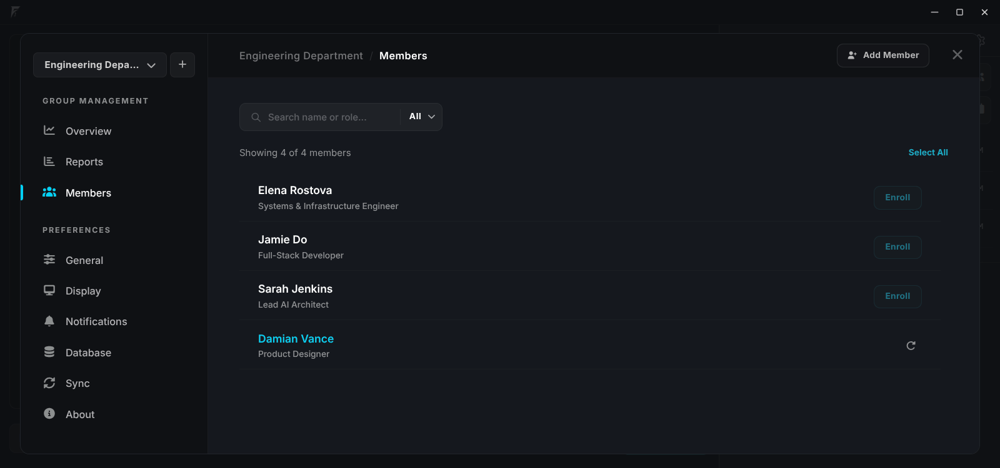
_Member management interface for profile administration, role assignment, and biometric enrollment._

### General

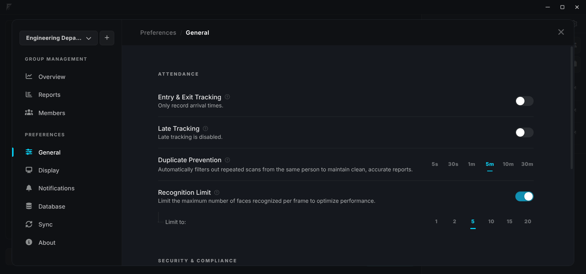
_Configuration controls for core attendance mechanics, including Entry/Exit modes, Late Tracking thresholds, Duplicate Prevention cooldowns, and Recognition Limits._

### Security & Compliance

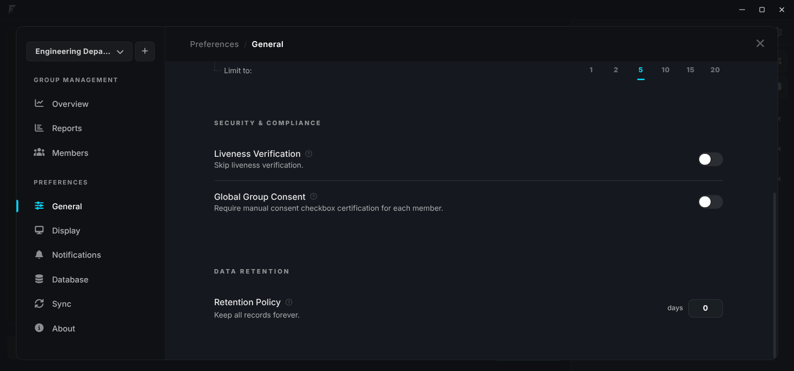
_Configuration panel for Anti-spoofing (Liveness Verification) toggles, Global Group Consent enforcement, and Data Retention policies._

### Database

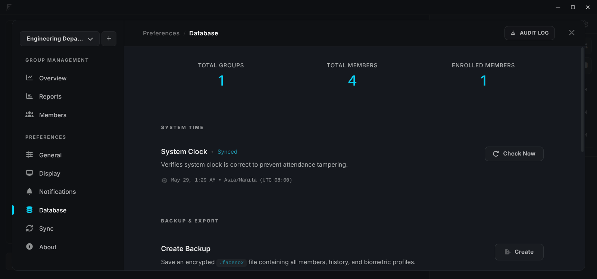
_Database settings panel detailing system clock accuracy validation and enrollment metrics across groups._

### Backup & Export

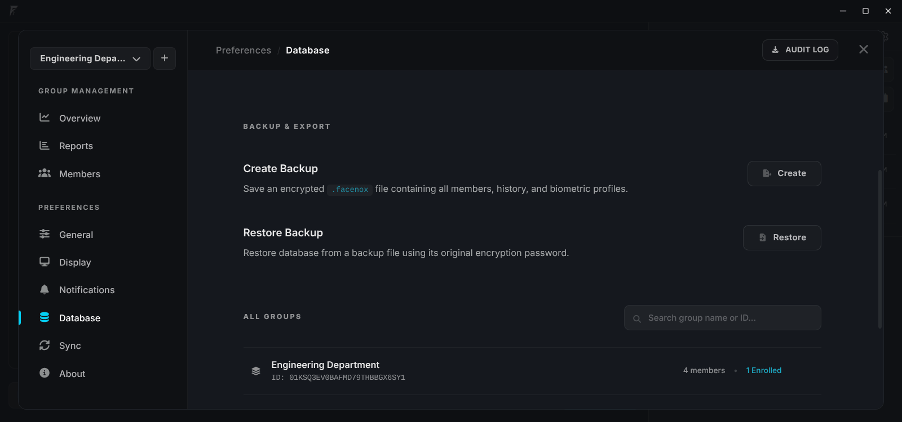
_Backup utilities for exporting and restoring the offline SQLite database and biometric profiles via encrypted archives._

</details>

---

> [!CAUTION]  
> This is the official open source repository for Facenox. Treat other repositories, installers, and downloads as unverified unless they come from official sources.

> [!NOTE]  
> **Privacy First:** Facenox processes face detection, tracking, and template matching locally. Encrypted face templates can optionally sync between your devices, with decryption keys stored on your paired hardware and encrypted in the cloud database.

## Why Facenox

Most face recognition systems rely on cloud-based biometrics. Facenox doesn't. Biometric matching stays local on the desktop.

| Feature                 |  Facenox   | Cloud-Based Systems |
| :---------------------- | :--------: | :-----------------: |
| **Data Residency**      | Encrypted End-to-End with Optional Cross-Device Sync |    Remote Cloud     |
| **Internet Dependency** |  Optional  |      Mandatory      |
| **Latency**             | Real-time  |  Network Dependent  |
| **Privacy Risk**        | Minimized  |        High         |

## Features

- **On-Device AI Inference:** Real-time face detection with recognition, ByteTrack multi-subject tracking, and liveness verification running entirely on local machine.
- **Cross-Platform:** Supports Windows, macOS, and Linux.
- **Consent-Aware:** Built-in compliance for biometric enrollment and deletion consent.
- **Directory Management:** Full control over group and member directories.
- **Attendance Tracking:** Automated session recording and CSV/JSON exports.
- **Secure Storage:** Encrypted local biometric storage and password-protected `.facenox` backups.
- **Optional Sync:** Secure pairing with Facenox Dashboard for centralized reporting. Encrypted face templates can sync between devices, using site-specific encryption keys.

## Performance

### Hardware Compatibility

- **No GPU Required:** Real-time matching on standard CPUs.
- **Environment:** Optimized for controlled lighting and consistent setups.
- **Hardware:** Verified on hardware as old as 2nd-gen Intel i7 (2011), 4th-gen i3 (2015), and 8th-gen i5 (2018) laptops.

### Performance Benchmark

Evaluated on the standard **LFW (Labeled Faces in the Wild)** dataset with **500 registered identities** on an Intel Core i5-8350U CPU without a dedicated GPU:

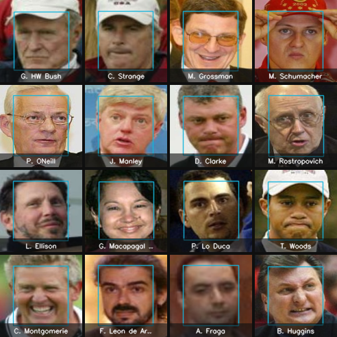

| Metric | Result | Target | Status |
| :--- | :---: | :---: | :---: |
| **Average search latency** | `14.56 ms` | < 50 ms | Passed |
| **Max search latency** | `52.34 ms` | < 150 ms | Passed |
| **Security (False match rate)** | `0.0%` | < 0.1% | Passed |
| **Rejection accuracy (TNR)** | `100.0%` | > 99.0% | Passed |
| **Recognition accuracy (TPR)** | `94.0%` | > 90.0% | Passed |

- **Security:** The system did not commit a single false match. An unregistered stranger will never be mistaken for a registered member.
- **Speed:** It takes less than 0.02 seconds to search and match a face against all 500 profiles in the database.
- **Accuracy:** It successfully recognizes registered members on the first try, even with changes in pose, expression, or lighting conditions.

To run the exact same test locally:
```bash
cd server
python tests/stress_test_recognition.py
```
*(The script will automatically download the test faces, run the simulation, and clean up afterwards.)*

> [!NOTE]
> **Scaling:** The benchmark above represents a worst-case scenario, searching all 500 profiles with no filtering. In actual use, Facenox limits face searches to the active group's members only, reducing both search time and false match risk in practice.

## Offline-First Behavior

Facenox Desktop continues to work locally when internet access is unavailable:

- Recognition and liveness verification remain functional.
- Attendance is recorded and stored permanently in a local SQLite database.
- Settings, backups, and member management remain accessible.
- Facenox Cloud sync resumes automatically when connectivity returns.
  (Completely optional, as cloud sync is disabled by default and only active when your device is paired.)

> [!NOTE]  
> **Privacy Assurance:** Facenox does not store or upload raw face photos. Raw camera frames are processed locally and are never persisted to disk. Biometric embeddings are encrypted with AES-256-GCM before optional cloud synchronization to enable multi-device sync and automatic backup. Matching always stays on your local hardware.

## How it works

### Where is the data stored?

Everything is stored in a local SQLite database on your machine. Biometric templates are encrypted at rest.

### Does it need the internet?

No. The local FastAPI server processes all camera frames on your machine. Internet connectivity is only required to upload attendance logs or sync encrypted templates to the web dashboard.

### What hardware do I need?

It's designed for standard CPUs and has been tested on hardware as old as 2nd-gen Intel i7 (2011), 4th-gen i3 (2015), and 8th-gen i5 (2018) laptops. No dedicated GPU or CUDA setup is required.

### How do I protect my data?

Because Facenox operates locally, no external servers have access to your database. Built-in backup utilities allow exporting encrypted `.facenox` archives for secure local or remote storage.

## Roadmap

- [x] Support for cross-platform native installers (Windows, macOS, Linux).
- [x] Attendance trends and site-level reporting in Facenox Dashboard.
- [ ] Software Signing.
- [ ] Mobile companion application for remote monitoring.

---

> [!IMPORTANT]
> **Security & Trust**
>
> - **Automated Audits:** GitHub CodeQL scans commits for security vulnerabilities on every push.
> - **Build Transparency:** GitHub Actions compiles all release binaries from public source code.
> - **Privacy First:** Devices encrypt all outbound templates with AES-256-GCM. The database only stores templates in encrypted form.

> **Management Dashboard:** The **official Facenox Dashboard** is an optional service for centralized reporting. This repository contains the source for the **desktop client** only.

## Download

Latest prebuilt binaries are available on the [GitHub Releases](https://github.com/facenox/facenox/releases/latest) page.

If you want to build from source, please follow the [Installation Guide](docs/INSTALLATION.md).

## Installation Notes

Facenox is in active development. Until code-signing is finalized in a future release, you may encounter OS security prompts.

> [!WARNING]  
> **OS Security Prompts & Installation Warnings:**
>
> **Windows (SmartScreen):** If blocked, click **More info** then **Run anyway**.
>
> 
>
> **macOS (Gatekeeper):** If blocked, **Right-click** the app, select **Open**, then confirm the prompt.
>
> 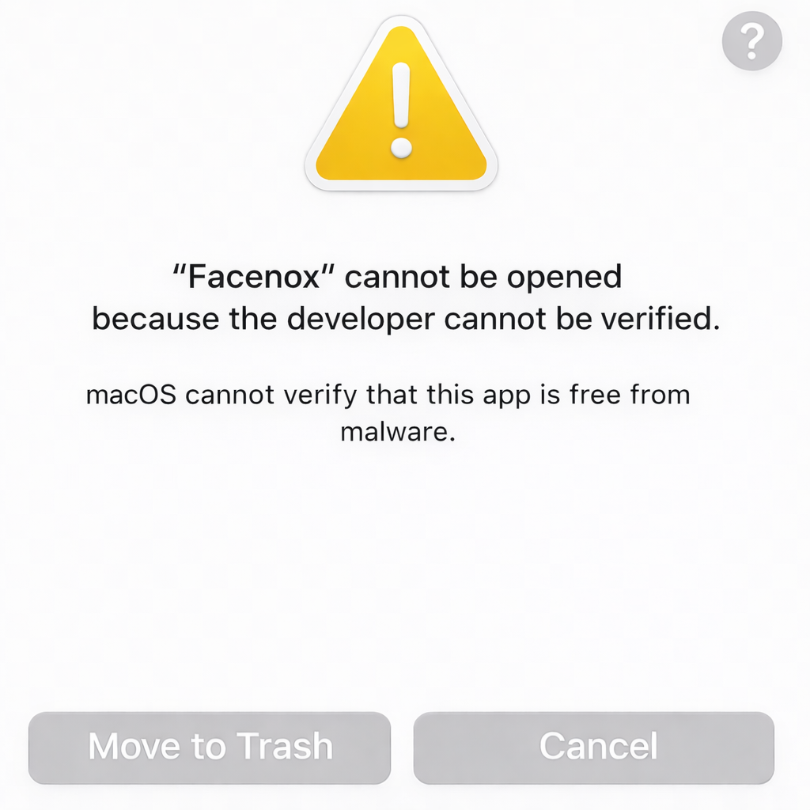
>
> **Linux (AppImage / Debian Package):**
>
> *Using the AppImage:*
> 1. Make the downloaded `.AppImage` file executable by right-clicking it -> **Properties** -> **Permissions** -> checking **Is executable** (or by running `chmod +x Facenox-Linux-*.AppImage` in the terminal).
> 2. Double-click the file to execute it. If prompted with a security warning (e.g., in KDE Dolphin), click **Continue**.
>
> 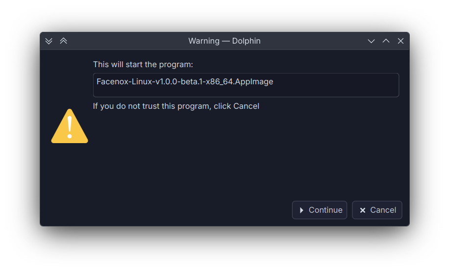
>
> *Compatibility Note:* Modern Linux distributions (e.g., Ubuntu 22.04+) require `libfuse2` to mount and run AppImages. If the app fails to start, install it by running:
> ```bash
> sudo apt update && sudo apt install libfuse2
> ```
> *(Warning: Do not install the package named `fuse` as it can conflict with your desktop environment.)*
>
> *Using the Debian Package (.deb):*
> 1. Install by running the following commands in the terminal (recommended to automatically resolve dependencies):
>    ```bash
>    sudo apt update
>    sudo apt install ./Facenox-Linux-*.deb
>    ```
>    *(Note: The `./` prefix is required for `apt` to identify the file as a local package.)*
> 2. Alternatively, double-click the `.deb` file to open it in your system's Software Center and click **Install**.

## Documentation

- [FEATURES.md](docs/FEATURES.md): Capabilities and out-of-scope items.
- [ARCHITECTURE.md](docs/ARCHITECTURE.md): System design and sync boundaries.
- [INSTALLATION.md](docs/INSTALLATION.md): Local development setup.
- [TROUBLESHOOTING.md](docs/TROUBLESHOOTING.md): Common setup and runtime issues.
- [CODE_SIGNING_POLICY.md](docs/CODE_SIGNING_POLICY.md): Release identity and trust rules.
- [PRIVACY.md](docs/PRIVACY.md): Data handling and consent policy.
- [SECURITY.md](SECURITY.md): Vulnerability reporting policy.
- [TESTING.md](app/TESTING.md): Frontend and Electron app testing conventions.

## Tech Stack

### Local Backend

- **Runtime:** Python 3.10+ (FastAPI)
- **Inference:** ONNX Runtime, OpenCV
- **Tracking:** ByteTrack (High-performance MOT)
- **Anti-Spoofing:** [face-antispoof-onnx](https://github.com/facenox/face-antispoof-onnx)
- **Storage:** SQLite, SQLAlchemy, Alembic

### Desktop App

- **Framework:** Electron, React 19
- **Build Tooling:** Vite, TypeScript, Tailwind CSS

## Development Quickstart

```bash
# 1. Clone the repo
git clone https://github.com/facenox/facenox.git
cd facenox

# 2. Setup Local Backend
python -m venv venv
source venv/bin/activate  # or venv\Scripts\activate
pip install -r server/requirements.txt

# 3. Setup Desktop App
pnpm install

# 4. Run Development Workspace
./dev-start.sh
```

## Contributing

Pull requests are welcome. Read [CONTRIBUTING.md](CONTRIBUTING.md) before opening a PR, especially for changes affecting privacy or biometric data.

## Acknowledgments

- [FastAPI](https://fastapi.tiangolo.com/)
- [ONNX Runtime](https://onnxruntime.ai/)
- [OpenCV](https://opencv.org/)
- [Electron](https://www.electronjs.org/)
- [React](https://react.dev/)
- [THIRD_PARTY_LICENSES.md](THIRD_PARTY_LICENSES.md)

## License

Facenox is licensed under the **GNU AGPL v3**. See [LICENSE](LICENSE) for details.
