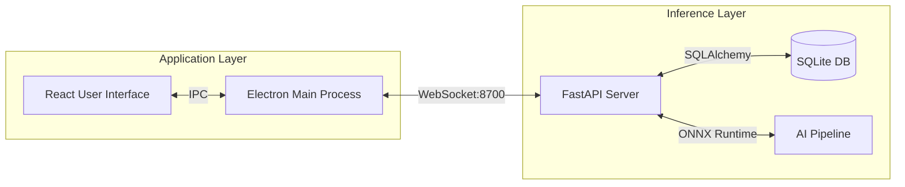

# System Architecture

Suri combines a React frontend with a Python backend for local inference.

## Diagram



## Tech Stack

### Frontend
- **Framework**: [React 19](https://react.dev/)
- **Bundler**: [Vite](https://vitejs.dev/)
- **Styling**: [Tailwind CSS v4](https://tailwindcss.com/)
- **State**: [Zustand](https://github.com/pmndrs/zustand)
- **Runtime**: [Electron](https://www.electronjs.org/)

### Backend
- **Runtime**: [Python 3.10+](https://www.python.org/)
- **API**: [FastAPI](https://fastapi.tiangolo.com/)
- **Database**: [SQLAlchemy](https://www.sqlalchemy.org/) + [Alembic](https://alembic.sqlalchemy.org/)
- **AI Runtime**: [ONNX Runtime](https://onnxruntime.ai/)

## Inference Pipeline

The application executes the computer vision pipeline sequentially on the local device.

### 1. Face Detection
- **Function**: Locates bounding boxes for faces.

### 2. Alignment
- **Method**: 5-Point Landmark Estimation.
- **Function**: Rotates and scales faces to a standard position.

### 3. Liveness Check
- **Function**: Classifies input as Real or Spoof (Photo/Screen).

### 4. Recognition
- **Function**: Generates a **512-d embeddings** from pixel data.
- **Comparison**: Cosine Similarity.

### 5. Tracking
- **Function**: Associates detections across frames by matching both high and low scoring boxes to recover lost objects.

## Database

Tables used for storage:
- **AttendanceGroup**: Logical container for users.
- **AttendanceMember**: The user entity.
- **AttendanceSession**: Defined time window for tracking.
- **AttendanceRecord**: Timestamped log of a recognized user.

## Project Structure

```bash
suri/
├── app/                  # Frontend (React + Electron)
│   ├── src/
│   │   ├── components/   # UI System
│   │   ├── electron/     # IPC Bridge & Main Process
│   │   └── services/     # WebSocket & State Logic
│   └── dist/             # Compiled Binaries
│
├── server/               # Backend (Python AI Engine)
│   ├── api/              # FastAPI Routes
│   ├── core/             # AI Pipeline (ONNX Wrappers)
│   ├── database/         # SQLAlchemy Models
│   ├── weights/          # AI Models
│   └── config/           # Configuration
│
└── docs/                 # Documentation
```
