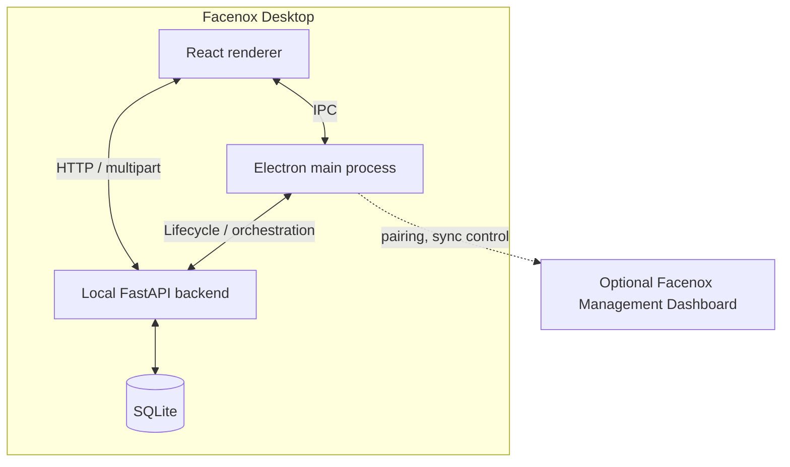

# Architecture

Facenox is a desktop-first system. Recognition, attendance, and biometric storage run on the local machine.

## Deployment Model

- Primary runtime: desktop app
- Primary database: local SQLite
- Network requirement for core attendance: none
- Biometric processing: local only; encrypted templates may sync between paired devices
- Optional remote integration: separate Facenox Management Dashboard deployment for reporting, device management, and encrypted template relay

## High-Level Components

```mermaid
graph TD
    subgraph Desktop["Facenox Desktop"]
        UI["React renderer"]
        MAIN["Electron main process"]
        API["Local FastAPI backend"]
        DB[("SQLite")]

        UI <-->|IPC| MAIN
        UI <-->|HTTP / multipart| API
        MAIN <-->|Lifecycle / orchestration| API
        API <--> DB
    end

    CLOUD["Optional Facenox Management Dashboard"]

    MAIN -. pairing, sync control .-> CLOUD
```

## Desktop Responsibilities

### React renderer

- camera and attendance UI
- member and group management
- settings, reports, and backup flows
- Management Dashboard Beta configuration UI

### Electron main process

- app lifecycle
- backend startup and health monitoring
- local settings persistence
- update checks
- Facenox Cloud pairing and sync orchestration

### Local FastAPI backend

- face detection and recognition endpoints
- anti-spoofing and attendance APIs
- export and import endpoints for backups and cloud sync
- local database access

### Local SQLite database

- groups and members
- attendance records and sessions
- consent metadata
- encrypted biometric templates
- audit and settings data

## Data Flow

### Desktop-only flow

1. The renderer captures camera frames and attendance input.
2. The renderer sends binary image data to the local FastAPI backend.
3. The backend runs detection, anti-spoofing, and recognition locally.
4. The backend writes results to the local SQLite database.

This path does not require internet access.

### Facenox Cloud integration flow

1. An admin generates a pairing code in Facenox Cloud.
2. The desktop app stores the cloud URL and redeems the pairing code.
3. The desktop receives an organization ID, site ID, device ID, and device token.
4. The desktop exports a local attendance snapshot.
5. The Electron sync manager wraps that export in a sync envelope and sends it to `POST /api/sync/push`.
6. After a successful push, the sync manager automatically pulls metadata (groups and members) from `GET /api/sync/pull` and imports them locally via `POST /attendance/import-metadata`.

The desktop remains the system of record for biometrics and local attendance capture.

When paired with Facenox Cloud, member and group directory authority shifts to the cloud control plane. Desktop member/group mutations are blocked by the backend (HTTP 403). Groups and members flow one way: Cloud → Desktop via pull. Attendance records and sessions are pushed Desktop → Cloud.

When multiple devices are paired to the same site, encrypted face templates can sync between them. Templates are encrypted before leaving the device and decrypted on destination devices in the same organization. Facenox Cloud stores these encrypted blobs in the database to sync them.

## Desktop and Facenox Cloud Boundary

The cloud boundary is intentionally narrow.

### Data that stays local

- raw face images (never leave the device)
- local face matching decisions
- local enrollment workflow and capture pipeline artifacts

### Data that may be sent encrypted to Facenox Cloud

- **encrypted face templates** (AES-256-GCM encrypted, decrypted on paired devices)
- organization, site, and device identifiers
- attendance records and sessions
- sync status and device health metadata

### Data that is sent for reporting and directory sync

- group and member metadata (needed for member/group management)
- attendance records and sessions (needed for reporting)

Groups and members are not sent to Cloud via push. They are pulled from Cloud to Desktop via `import-metadata` after each push.

## Sync Model

The sync design is event-driven and resilient.

- push-then-pull: desktop pushes attendance snapshots, then pulls groups and members metadata from cloud
- snapshot-based push with real-time event stream: attendance data is pushed as snapshots; the desktop also maintains an SSE connection (`/api/sync/events`) for real-time sync triggers (`POLICY_UPDATE`, `MEMBERS_UPDATE`, `SYNC_REQUEST`)
- member/group flow is one-way: Cloud → Desktop. After each push, `import-metadata` upserts incoming groups/members and prunes any local group or member with a `remote_id` that no longer exists in the pull response
- when paired, Desktop member/group mutations are blocked by the local backend (HTTP 403). The Desktop Kiosk UI hides member/group mutation buttons when paired.
- auto-sync available in the desktop app
- manual `Sync Now` available as an override
- initial sync runs immediately after pairing
- catch-up sync runs on startup when the device is overdue

If Cloud Sync fails, local attendance continues uninterrupted.

## Not in This Repository

This repository does not implement:

- Remote-side face matching
- two-way sync for members or attendance edits (member/group sync is intentionally one-way: Cloud → Desktop)
- payroll or HRIS integrations
- mobile clients

Those concerns belong to the separate Facenox Cloud architecture and should be documented there directly.
